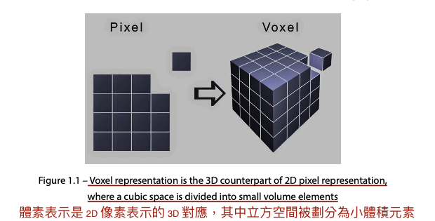
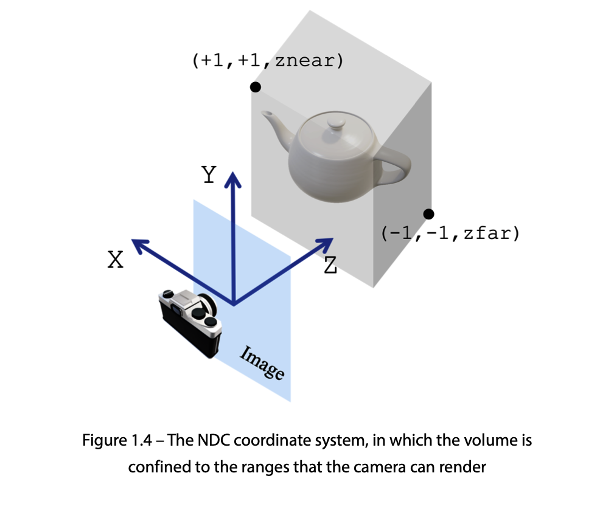
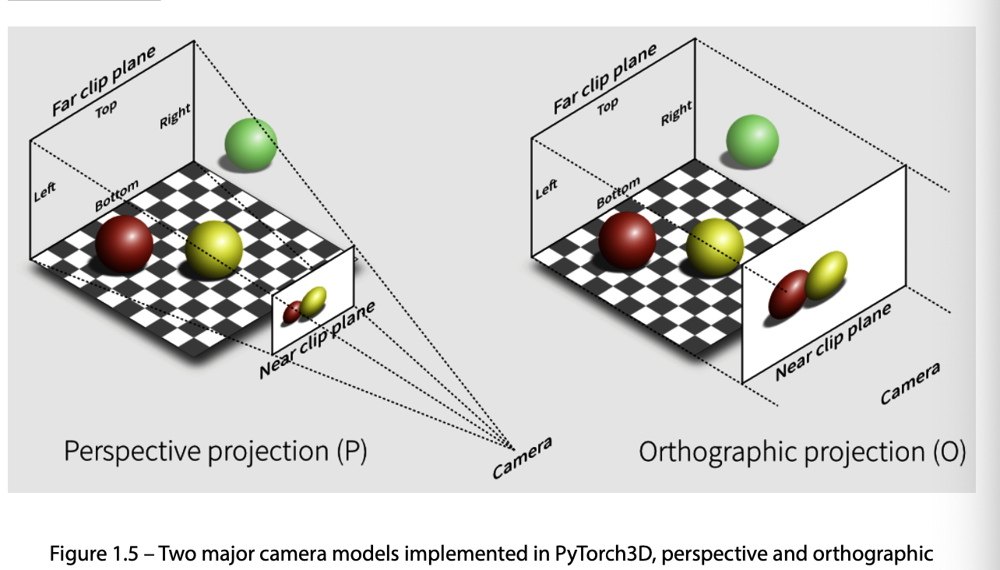

# Introducing 3D data Processing 
## 3D data representation
對於許多 3D 深度學習系統來說，選擇數據表示是一個特別重要的設計決策。

我們將在本節中更詳細地討論這些 3D 表示的優缺點。 廣泛使用的 3D 數據表示通常包括點雲、網格和體素。

### point cloud 點雲
表現形式是元組（x,y,z）

從深度學習的角度來看，3D點雲是無序、不規則的數據類型之一。 
與常規圖像不同，我們可以為每個單獨的像素定義相鄰像素，而點雲中每個點的相鄰點沒有明確且規則的定義——也就是說，
**卷積通常不能應用於點雲。** 因此，需要使用特殊類型的深度學習模型來處理點雲，例如PointNet
> **PointNet**
> this是一個直接消耗點雲的神經網路，which很好尊重了點雲的排列不變性的特性。
> 分類架構是，使用n個點作為輸入，應用特徵變換，通過最大池化聚合點特徵，輸出k個類別的分類分數。使用的神經元都為mlp，多層感知機

點云作為 3D 深度學習訓練數據的另一個問題是異構數據問題，即對於一個訓練數據集，不同的點雲可能包含不同數量的 3D 點。
避免此類異構數據問題的一種方法是強制所有點雲具有相同數量的點。 然而，這並不總是可能的——例如，深度相機返回的點數可能因幀而異。

點雲中的異構數據會對模型中的小批次梯度下降造成一些困難。
好在pytorch3d給我們了一些方法，可以讓點雲數據成為，每個小批量包含相同大小和維度的尺寸。

### Mesh representation 網格像素
網格是另一種廣泛使用的 3D 數據表示形式。 與點雲中的點一樣，每個網格都包含一組稱為頂點的 3D 點。 此外，每個網格還包含一組稱為面的多邊形，它們在頂點上定義。

在大多數數據驅動的應用程序中，**網格是深度相機原始測量結果後處理的結果**。 

通常，它們是在 3D 資產設計過程中手動創建的。 與點雲相比，網格包含額外的幾何信息、編碼拓撲並具有表面法線信息。 
這些附加信息在訓練學習模型時特別有用。 例如，**圖卷積神經網絡**通常將網格視為圖，並使用頂點鄰近信息定義卷積運算。
就像點雲一樣，網格也有類似的異構數據問題。 同樣，PyTorch3D 提供了處理網格數據的異構小批量的有效方法，這使得 3D 深度學習變得高效。

### voxel representation 體素
另一個重要的 3D 數據表示是體素表示。 體素相當於 3D 計算機視覺中的像素。 
像素是通過將二維矩形分成更小的矩形來定義的，每個小矩形是一個像素。 類似地，體素是通過將 3D 立方體劃分為較小尺寸的立方體來定義的，
每個立方體稱為一個體素。 流程如下圖所示：

體素經常用**Truncated Signed Distance Functions （TSDFs）截斷符號距離函數（TSDF）** 來表示3D形狀。

**Signed Distance Function 有符號距離函數 (SDF)**可以在每個體素處定義為體素中心到表面上最近點之間的（有符號）距離。 SDF 中的正號表示體素中心位於對像外部。 TSDF 和 SDF 之間的唯一區別在於 TSDF 的值被截斷，使得 TSDF 的值始終在 -1 到 +1 之間。

不同於點雲和網格數據，體素數據是有序且有規律的。
可以用在~~深度學習模型中~~使用卷積濾波器。 體素表示的一個潛在缺點是它通常需要更多的計算機內存，但可以通過使用散列等技術來減少這一缺點。 然而，體素表示是一種重要的 3D 數據表示。

### Something else 
除了這裡提到的之外，還有 3D 數據表示形式。 例如，**多視圖表示**使用從不同視點拍攝的多個圖像來表示 3D 場景。**RGB-D** 表示使用附加深度通道來表示 3D 場景。

## 3d data file format 
### Ply files 
文件格式有 ASCII 版本和二進製版本。 在需要文件大小和處理效率的情況下，首選二進製版本。 ASCII 版本使其非常容易調試。 在這裡，我們將討論 PLY 文件的基本格式以及如何使用 Open3D 和 PyTorch3D 從 PLY 文件加載和可視化 3D 數據。
等會學習怎麼使用pytorch3d來加載和保存ply files文件。
> load_save_ply.py
> tips:pytorch3d 和torch有版本對應，

### Obj files 
也有二進制格式和ASCII格式

暫時暫停，等bug修復
## 3d coordination systems
坐標系統

標準化設備坐標 (NDC) 限制了相機可以渲染的體積。 NDC 空間中的 x 坐標值範圍為 -1 到 +1，y 坐標值也是如此。 z 坐標值的範圍從 znear 到 zfar，其中 znear 是最近深度，zfar 是最遠深度。 相機不會渲染此 znear 到 zfar 範圍之外的任何對象。
最後，屏幕坐標係是根據渲染圖像在屏幕上的顯示方式來定義的。 坐標系包含作為像素的列的x坐標、作為像素的行的y坐標以及對應於對象的深度的z坐標。
為了在 2D 屏幕上正確渲染 3D 對象，我們需要在這些坐標系之間切換。 幸運的是，這些轉換可以通過使用 PyTorch3D 相機模型輕鬆執行。 在討論相機模型之後，我們將更詳細地討論坐標轉換。

## camera model 
在 PyTorch3D 中，有兩種主要的相機模型，由 OrthographicCameras 類定義的**正交相機**和由 PerspectiveCameras 類定義的**透視相機**模型。 下圖展示了兩種相機型號之間的差異。

## Coding for camera models and coordination systems 
> model_coordination.py