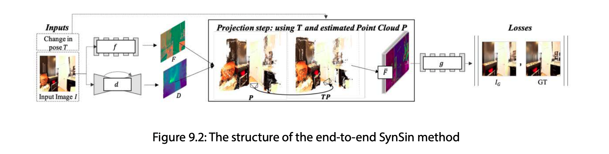

# Performing End-to-End View Synthesis with SynSin 
視圖合成是3D深度學習的主要方向之一，可用於AR、VR、遊戲等領域。 目標是為給定圖像建立一個模型作為輸入，以從另一個視圖重建新圖像。
## Overview of view synthesis 
3D 電腦視覺中最受歡迎的研究方向之一是視圖合成。 給定資料和視點，研究方向的想法是產生一個新影像，從另一個視點渲染物件。

視圖合成有以下的方法
- **View synthesis from multiple images**:深度神經網路可用於學習多個影像的深度，然後從另一個視圖重建新影像。 然而，如前所述，這意味著我們有多個來自略有不同視圖的圖像，有時很難獲得此類數據。

- **View synthesis using ground-truth depth**:這涉及一組技術，其中在圖像旁邊使用真實掩模，它代表圖像的深度和語義。 儘管在某些情況下，這些類型的模型可以取得良好的效果，但大規模收集資料非常困難且昂貴，尤其是在戶外場景時。 此外，大規模註釋此類資料也既昂貴又耗時。
  
- **View synthesis from a single image**: 當我們只有一張圖像並且我們的目標是從新視圖重建圖像時，這是一個更現實的設定。 僅使用一張影像很難獲得更準確的結果。 SynSin 屬於一組可以實現最先進的視圖合成的方法。
  
SynSin 好，認真看看 

## SynSin network architecture

模型包含三個部分
- Spatial feature and depth networks
- Neural point clound render 
- Refinement module and discriminator 

### Spatial feature and depth networks
> 空間特徵和深度網絡

有兩個網路，分別從輸入圖片中提取特徵網路和深度網路。

給定參考影像和所需的姿勢變化 (T)，我們希望產生一個影像，就好像姿勢的變化應用於參考影像一樣。 對於第一部分，我們僅使用參考圖像並將其饋送到兩個網路。

**空間特徵網路**旨在學習特徵圖，特徵圖是影像的更高解析度表示。 模型的這一部分負責學習圖像的語意資訊。 該模型由 8 個 ResNet 區塊組成，為影像的每個像素輸出 64 維特徵圖。 輸出的解析度與原始影像相同。

接下來，**深度網路**旨在學習影像的 3D 結構。 它不會是精確的 3D 結構，因為我們不使用精確的 3D 註解。 然而，該模型將進一步改進它。
此網路使用具有八個下採樣和上採樣層的 UNet，後面是 sigmoid 層。 同樣，輸出具有與原始影像相同的解析度。


### Neural point cloud renderer 
> 神經點雲渲染器

下一步是建立 3D 點雲，然後將其與視圖變換點一起使用，從新視點渲染新影像。 為此，我們使用空間特徵和深度網路的組合輸出。


為了克服這裡提出的問題，該模型試圖軟化艱難的決策。 這種技術稱為神經點雲渲染器。

為此，渲染器不是為點分配像素，而是具有不同的影響力。 這解決了一個小鄰裡問題。 對於硬 z 緩衝區問題，我們然後累積最近點的效果，而不僅僅是最近點：

3D 點被投影並以半徑 r 分佈（圖 9.5）。 那麼，3D點對,此像素是透過噴濺點的中心到該點之間的歐幾里德距離來測量的：

最後，我**們需要在 z 緩衝區中收集和累積點。 首先，我們根據點與新相機的距離對點進行排序，然後使用帶有 alpha 合成的 K-近鄰來累積點**
### Refinement module and discriminator 
> 細化模組和鑑別器

此模組有兩個任務：首先提高投影特徵的準確性，其次從新視圖填充影像的不可見部分。

細化模組（g）從神經點雲渲染器取得輸入，然後輸出最終的重建影像。 然後，將其用於損失目標以改善訓練過程。

這個任務是透過生成模型來解決的。 使用具有八個區塊的 ResNet，並且為了保持影像的良好分辨率，還使用了下取樣和上取樣區塊。

我們使用帶有兩個多層鑑別器的 GAN 以及鑑別器上的特徵匹配損失。
模型的最終損失由L1損失、內容損失和判別器損失組成和產生的影像和目標影像：
$$
l = \lambda_{GAN}l_{GAN} + \lambda_{l1}l_{l1} + \lambda_{c}l_{c} 
$$

The loss function is then used for model optimization as usual.

## Hands-on model training and testing 
```
git clone https://github.com/facebookresearch/synsin.git
```
更新上面repo的`./options/options.py` 添加`KITTI`數據集
```python
elif opt.dataset=='kitti':
    opt.min_z = 1.0 
    opt.max_z = 50.0
    opt.train_data_path = (
        './DATA/dataset_kitti/'
    )
    from data.kitti import KITTIDataLoader
    return KITTIDataLoader
```
進行訓練
```powershell
python train.py --batch-size 32 \
 --folder 'temp' --num_workers 4 \
 --resume --dataset 'kitti' --use_inv_z \
 --use_inverse_depth \
 --accumulation 'alphacomposite' \
 --model_type 'zbuffer_pts' \
 --refine_model_type 'resnet_256W8UpDown64' \
 --norm_G 'sync:spectral_batch' \
 --gpu_ids 0,1 --render_ids 1 \
 --suffix '' --normalize_image --lr 0.0001
```

模型推理
``` powershell 
export KITTI=${KITTI_HOME}/dataset_kitti/images
python evaluation/eval_kitti.py --old_model ${OLD_MODEL} 
--result_folder ${TEST_FOLDER}
```


下一個腳本為每個影像建立產生的真實值對：

第一個圖像是輸入圖像，第二個圖像是真實圖像。
第三張圖片是網路輸出。 您可能已經注意到，相機稍微向前移動，對於這種特定情況，模型輸出似乎產生得很好


然而，我們需要一些數字表示來了解網路的工作情況。
這就是為什麼我們需要執行evaluate/evaluate_perceptualsim.py文件，
這將計算準確性：
``` powershell 
python evaluation/evaluate_perceptualsim.py \
 --folder ${TEST_FOLDER} \
 --pred_image im_B.png \
 --target_image im_res.png \
 --output_file kitti_results
 
```
